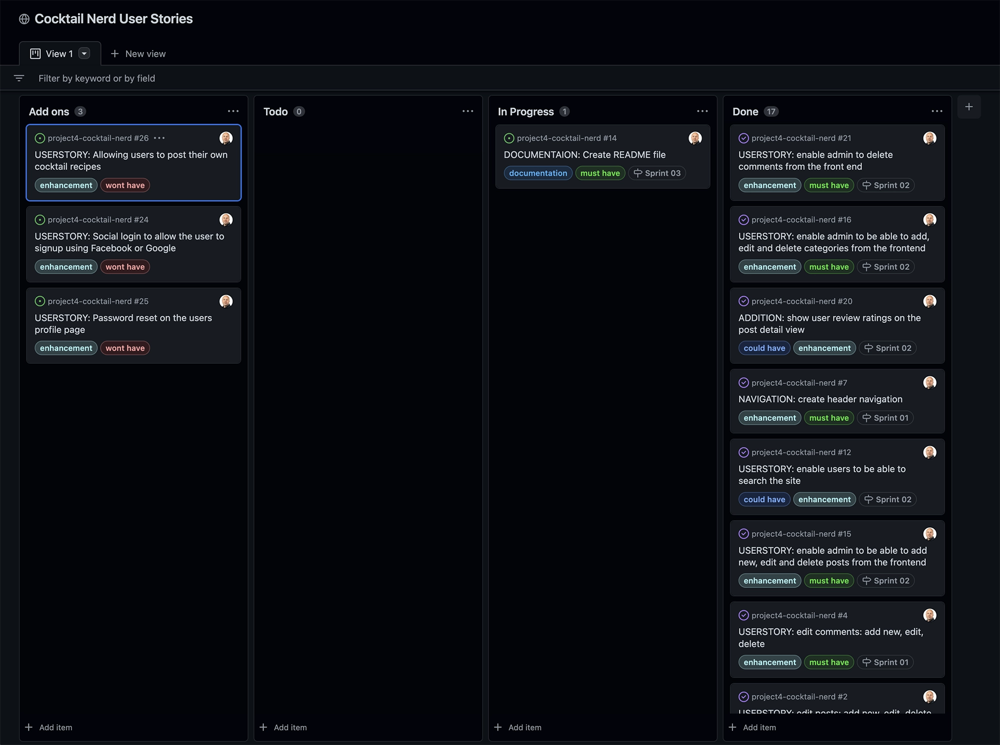
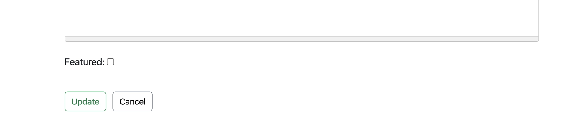
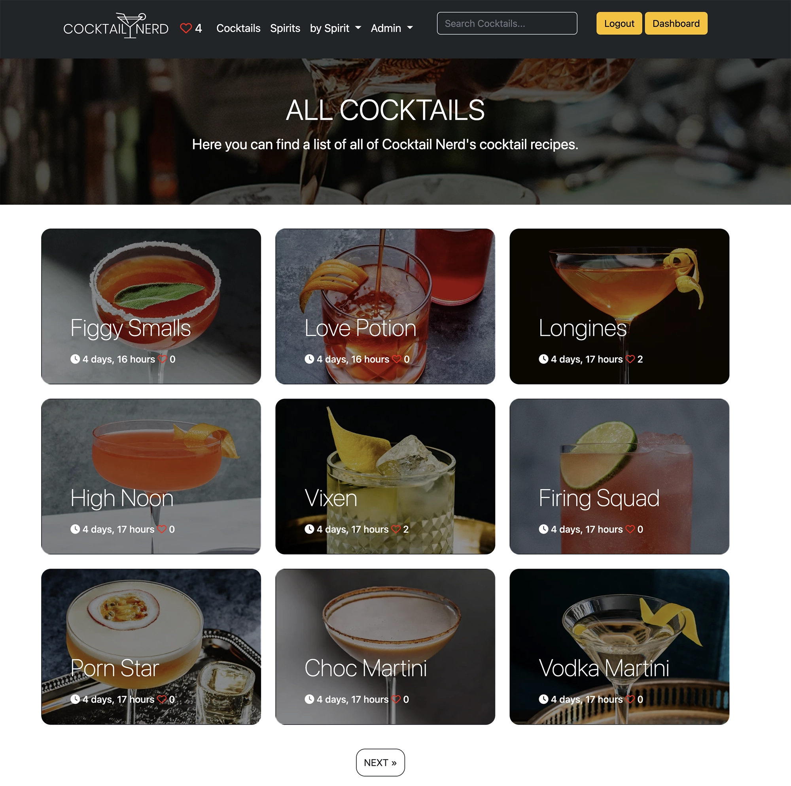
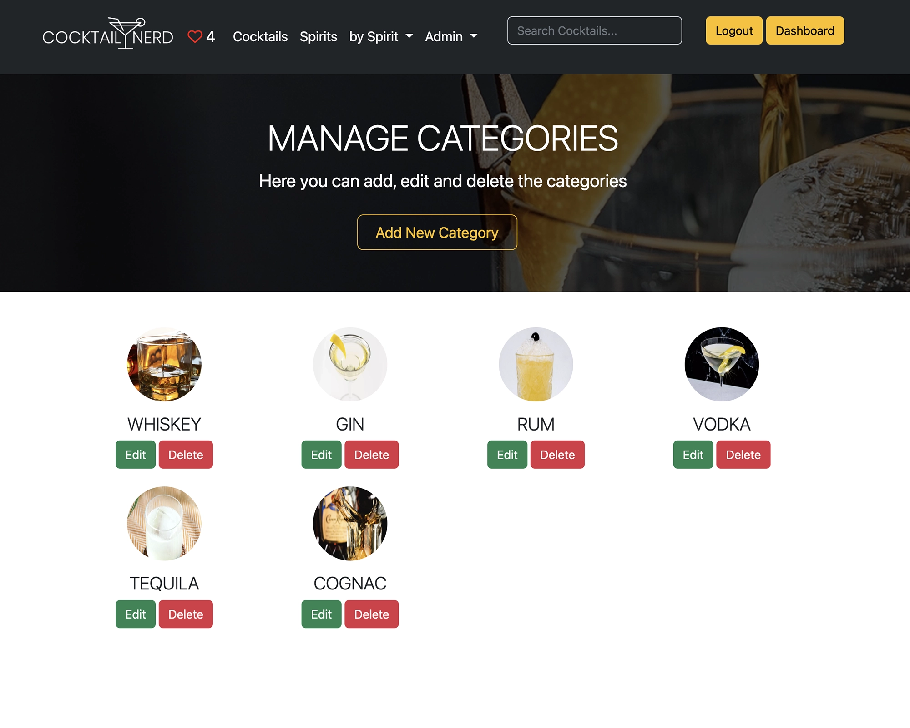

 
<h2>Your expert cocktail guide, featuring hand-selected cocktail recipes. 
Find great new drinks to try plus helpful tips and advice.</h2>

<h1 id="contents">Contents</h1>

- [Introduction](#introduction)
 - [User Experience - UX](#user-experience)
    - [User Stories](#user-stories)
    - [Agile Methodology](#agile-methodology)
    - [The Scope](#the-scope)
- [Design](#design)
    - [Colours](#colours)
    - [Typography](#typography)
    - [Media](#media)
    - [Database](#database)
    - [Wireframes](#wireframes)
- [Features](#features)
    - [Future Features](#future-features)
- [Technologies](#technologies)
    - [Languages](#languages)
    - [Django Packages](#django-packages)
    - [Frameworks & Libraries](#frameworks)
- [Development & Testing](#testing)
    - [Database](#database)
    - [Testing Results](TESTING.md)
- [Deployment](#deployment)
- [Credits](#credits)

<h1 id="introduction">Introduction</h1>

Project Milestone 4 for Code Institute Full-stack development program. Cocktail Nerd - is a full stack Django project that runs on Heroku.

The site allows staff users to edit posts, categories and comments from the frontend once logged in & registered users can login to comment,like & rate cocktail recipes.

<h1 id="demo">Live Site</h1>
A live version of the site can be found <a href="https://project4-cocktail-nerd.herokuapp.com/" target="_blank">**HERE**</a>  
  

<h1 id="user-experience">User Experience - UX</h1>

<a href="#top">Back to the top.</a>

<h2 id="user-stories">User Stories</h2>

* As a website user, I can:

1. Navigate around the site and easily view the desired content.
2. View a list of cocktail recipes and choose accordingly.
3. Search cocktail recipes to find specific recipes.
4. Click on post to read the cocktail recipe details.
5. Register for an account to like, rate or comment on a cocktail recipe.
6. View the number of likes on a cocktail recipe.
7. View comments on cocktail recipes so that I can read other users opinions.

* As an authenticated website user, I can:

1. Like/unlike cocktail recipes and view my liked cocktail recipes on a single liked cocktails page.
2. Comment on cocktail recipes and give my opinion about the posts.
3. Delete or edit my previous comments.
4. Manage my profile by updating my details and avatar.

* As a website staffuser, I can:

1. Create and publish a new cocktail recipe.
2. Create draft recipe posts that can be reviewed and finalised later.
3. Create new cocktail recipes and cocktail categories.
4. Edit cocktail recipes, cocktail categories and comments.
5. Delete cocktail recipes, cocktail categories and comments.

* As a website superuser, I can:

1. Create and publish a new cocktail recipe.
2. Create draft recipe posts that can be reviewed and finalised later.
3. Create a new user, cocktail recipes and cocktail categories.
4. Edit cocktail recipes, cocktail categories and comments.
5. Delete a user, cocktail recipes, cocktail categories and comments.
6. Approve user's comments.
7. Change the website permissions for a user.

<h2 id="agile-methodology">Agile Methodology</h2>

The Agile Methodology was used to plan this project. This was implemented through Github and the Project Board which can be seen here -  <a href="https://github.com/users/artcuddy/projects/2" target="_blank"> Cocktail Nerd User Stories</a>

Through the use of the Kanban board in the projects view in Github, the project was divived into a few different sections:
* Addons
* Todo
* In Progress
* Done

Github issues were used to create User Stories and any other fixes or updates for the project. This was where the project user was assigned, labels were added to provide clarity, and the story was added to the appropriate sprint and the project. Each User Story, Fix or Update had a clear title. 

Milestones were used to create sprints. There were 3 sprints each dated appropriately. User Stories were completed based on the current sprint in progress. Each sprint was completed on time.

3 enhancement features were not completed and left as [Future Features](#future-features) for further development.

The Github issues were not just used to record User Stories but also used to record any bug fixes or updates to the codebase as well.

<h2 id="the-scope">The Scope</h2>

* To provide users with a good clean experience when using the Cocktail Nerd website.
* To provide users with a visually pleasing website that is intuitive to use and easy to navigate.
* To provide a website with a clear purpose.
* To provide role-based permissions that allows user to interact with the website example: like, comment or rate a cocktail.
* To provide search functionality to find cocktails on the Cocktail Nerd site.

<h1 id="design">Design</h1>

<a href="#top">Back to the top.</a>

<h2 id="colours">Colours</h2>

* I decided to stick with the high contrast Bootstrap 5 colour palette to maintain a nice visual contrast when viewing the site

<h2 id="typography">Typography</h2>

* Utilised the Bootstrap 5 native font stack that selects the best font-family for each OS and device.

<h2 id="media">Media</h2>

* All cocktail recipes are from<a href="https://www.liquor.com/" target="_blank"> Liqour.com </a> 

* All page header images are from<a href="https://unsplash.com/" target="_blank"> Unsplash </a> 

* The logo and favicon are designed by me in<a href="https://www.sketch.com" target="_blank"> Sketch </a> 

<h2 id="database">Database Diagram</h2>

<h2 id="wireframes">Wireframes</h2>

Initial Wireframes

<h1 id="features">Features</h1>

<a href="#top">Back to the top.</a>

## Homepage

* The Home Page is the landing page of the website and that's visible first when the site loads. It is designed to allow the user to quickly find their way around the site. The homepage displays the latest 6 featured cocktails.

## Navigation Desktop

* The site navigation is done through the navigation bar at the top of each page & this is consistant throughout the website.

* The navigation bar at the top of each page is sticky to allow access to the navigation at any time.

* Options on the navigation bar change depending on whether the user is logged in or not, or is an admin/staffuser or not.

* Navigation menu when nobody is logged in only options are login or sign-up.

* Navigation menu when regular authenticated user is logged in no access to Admin or Dashboard menu.

* Navigation menu when staffuser user is logged in has access to the Admin menu but not the Dashboard menu.

* Navigation menu when admin user is logged in has access to the Admin menu & the Dashboard menu.

## Navigation Mobile

* Navigation menu when nobody is logged in only options are login or sign-up.

* Navigation menu when regular authenticated user is logged in no access to Admin or Dashboard menu.

* Navigation menu when staffuser user is logged in has access to the Admin menu but not the Dashboard menu.

* Navigation menu when admin user is logged in has access to the Admin menu & the Dashboard menu.

## Cocktail Recipe Details

* When an authenticated user is logged in they can like, comment and rate a cocktail on the post detail page. If rated the user will see a notification of the rate given.

* If a comment is submitted this will have to be approved by an Admin user before it is displayed on the site

## Cocktail Recipe Sidebar

* When in a cocktail details page the sidebar will display all Spirit category links and will display the latest 6 featured cocktails which can be added to by clicking the featured check box on the post edit screen

## Liked Cocktails

* When an authenticated user likes a cocktail this will be added to their liked posts page which can be accessed by clicking on the heart icon on the navbar.

## All Cocktails

* To see all cocktails on a paginated page click the cocktails menu or button on the homepage

## All Spirit Categories

* To see all the spirit categories on a paginated page click the Spirits menu in the navbar

## Select Cocktails by Spirit Category

* To see all cocktails by spirit on a paginated page click the by Spirit menu in the navbar and select the spirit category

* All cocktails by spirit category this one displays all the Whiskey Cocktails 

## Search results

* Enter a search word in the search box and click enter the search results will be displayed on the search results page

* The search is performed on the Title & the Ingredients fields

## Admin on the frontend

* Superusers or staffusers are able to magae the posts and actegories on the frontend by selecting the Post Mgt or Category Mgt link from the Admin dropdown menu.

* This brings you to the Post Mgt & Categoy Mgt pages where posts can be edited or deleted.

<h2 id="future-features">Possible Future Features</h2>

* Social login to allow the user to signup using Facebook or Google 

* Password reset on the users profile page

* Allowing users to post their own cocktail recipes 

<h1 id="technologies">Technologies</h1>

<a href="#top">Back to the top.</a>

Throughout the planning, design, testing and deployment of the Cocktail Nerd Website , I have used a number of technologies listed below:

<h2 id="languages">Languages Used</h2>

* [HTML 5](https://en.wikipedia.org/wiki/HTML/)
* [CSS 3](https://en.wikipedia.org/wiki/CSS)
* [JavaScript](https://www.javascript.com/)
* [Django](https://www.python.org/)
* [Python](https://www.djangoproject.com/)

<h2 id="django-packages">Django Packages Used</h2>

* [Gunicorn](https://gunicorn.org/) 
   As the server for Heroku
* [Cloudinary](https://cloudinary.com/) 
   Was used to host the static files and media
* [Dj_database_url](https://pypi.org/project/dj-database-url/) 
   To parse the database URL from the environment variables in Heroku
* [Psycopg2](https://pypi.org/project/psycopg2/) 
   As an adaptor for Python and PostgreSQL databases
* [Summernote](https://summernote.org/) 
   As a text editor
* [Allauth](https://django-allauth.readthedocs.io/en/latest/installation.html) 
   For authentication, registration, account
   management
* [Crispy Forms](https://django-crispy-forms.readthedocs.io/en/latest/) 
   To style the forms
* [Whitenoise](http://whitenoise.evans.io/en/stable/) 
   For static CSS on Heroku
* [Django Star Ratings](https://pypi.org/project/django-star-ratings/) 
   For rating system on Cocktail Nerd
* [Selenium](https://www.selenium.dev/) 
   For automated functional testing

<h2 id="frameworks">Frameworks - Libraries - Programs Used</h2>

* [Bootstrap](https://getbootstrap.com/) 
   Was used to style the website, add responsiveness and interactivity
* [Jquery](https://jquery.com/) 
   All the scripts were written using jquery library
* [Git](https://git-scm.com/) 
   Git was used for version control by utilizing the Gitpod terminal to commit to Git and push to GitHub
* [GitHub](https://github.com/) 
   GitHub is used to store the project's code after being pushed from Git
* [Heroku](https://id.heroku.com) 
   Heroku was used to deploy the live project
* [PostgreSQL](https://www.postgresql.org/) 
   Database used through heroku.
* [VSCode](https://code.visualstudio.com/) 
   VSCode was used to create and edit the website
* [Lucidchart](https://lucid.app/) 
   Lucidchart was used to create the database diagram
* [PEP8](http://pep8online.com/) 
   PEP8 was used to validate all the Python code
* [W3C - HTML](https://validator.w3.org/) 
   W3C- HTML was used to validate all the HTML code
* [W3C - CSS](https://jigsaw.w3.org/css-validator/) 
   W3C - CSS was used to validate the CSS code
* [Fontawesome](https://fontawesome.com/) 
   To add icons to the website
* [Google Chrome Dev Tools](https://developer.chrome.com/docs/devtools/) 
   To check App responsiveness and debugging
* [Balsamiq](https://balsamiq.com/) 
   To build the wireframes for the project
* [Adobe Photoshop](https://www.adobe.com/ie/products/photoshop.html) 
   To convert the images to webp format
* [Sketch](https://www.sketch.com/) 
   To build the logo and icon for the project

<h1 id="testing">Development & Testing</h1>

<a href="#top">Back to the top.</a>

<h2 id="testing-results">Automated Testing Results</h2>

* Automated Testing results [here](TESTING.md)

<h2 id="testing-results">Manual Testing Results</h2>

* Manual Testing results [here](TESTING.md)

<h1 id="deployment">Deployment</h1>

<a href="#top">Back to the top.</a>

### This project was created on GitHub and Edited in GitPod by carrying out the following:

<ol>
    <li>A new repository was created using 'Code-Instutute-Org/python-essentials-template'</li>
    <li>A meaningful name was given to my new repository and I selected 'Create Repository'</li>
    <li>I then opened the repository on GitHub and clicked the 'Gitpod' button to build the GitPod workspace which would allow me to build and edit the code used to make the <em>Cocktail Nerd</em> website.</li>
    <li>Version control was used throughout the project using the following commands in the terminal using Bash
        <ul>
            <li>git add . <strong>OR</strong> git add "file name" - to stage the changes and get them ready for being committed to the local repo.</li> 
            <li>git commit -m "Description of the update" - to save the change and commit the change to the local repo</li>
            <li>git push - to push all committed changes to the GitHub</li>
            <li>commit --amend - for changing the wording or spelling of the most recent commit</li>
            <li>git reset "commit hash" </li>
            <li>git push -f - This was used to force changes through to the GitHub repo if either "commit --amend" or "git reset" were used</li>
        </ul>
    </li>

### Heroku

The project was deployed via <a href="https://id.heroku.com/login" target="_blank">Heroku</a>, and the live link can be found here: <a href="https://project4-cocktail-nerd.herokuapp.com/" target="_blank">Cocktail Nerd</a>

This project was developed utilising the <a href="https://github.com/Code-Institute-Org/python-essentials-template" target="_blank">Code Institute Template</a>. Some of the deployment steps below are specifically required for the new CI template and may not be applicable to older versions, or different projects.

Before deploying to Heroku pip3 freeze > requirements.txt was used to add all dependencies for deployment.

This project was deployed to Heroku using the Heroku CLI details below

* Login
To use the CLI you must log in to your Heroku account. To do this you will need to
enter the command heroku login -i in the terminal. It requires the email and
password you used to sign up. If you have enabled multi-factor authentication (a
recommended security practice) then instead of your password you need an API key.
To get the API key go to your account settings and scroll down to the section ‘API
Key’. Click reveal and copy that, then paste it into the password prompt.

  

* Creating A Heroku App
Now that you are logged in, the first thing is to create a new app. Heroku creates a
URL based on your app name, so it must be unique not only on your account, but
across the whole site. You may need to try a few different names. To create an app
use the following command, where myapp is the name of your app.
 
  

* Here the app heroku-cli-example has been created with an output of the website
URL. It also displays and sets the git remote repository which will be used to deploy.
By default the region will be set to the US. If you would prefer a server based in the
EU then you can specify the region with the flag EU

* Packages
* When you push code to Heroku it will look at the repository contents to decide how
to build the project. One of the factors taken into consideration is the package file.
With a Python project the standard file is a requirements.txt file, which will have the
list of packages needed to run the project. If this file is present it will build the project
using the Python buildpack.

* It is also possible to specify the buildpack manually. More information about
buildpacks can be found in the documentation. To check the buildpack for the
project you can enter heroku buildpacks in the terminal.

* Created .slugignore with /documentation, README.md & TESTING.md as I don't want the documentation to upload to Heroku.

* Click **Enable Automatic Deploys** for automatic deployment when you push updates to Github.

* Select the correct branch for deployment from the drop-down menu and click **Deploy Branch** for manual deployment.

### Github Local Deployment
There are many ways to deploy the project locally on your own device. Forking, Cloning, GitHub Desktop and Zip Exctraction, the steps in these processes are outlined below:

#### Forking the GitHub repo
If you want to make changes to the repo without affecting it, you can make a copy of it by 'Forking' it. This will make sure that the original repo remains unchanged.

<ol>
    <li>Log in to your GitHub account</li>
    <li>Navigate to the repository <a href="https://github.com/artcuddy/project4-cocktail-nerd" target="_blank"><strong>HERE</strong></a></li>
    <li>Select the 'Fork' button in the top right corner of the page (under your account image)</li>
    <li>The repo has now been copied into your own repos and you can work on it in your chosen IDE</li>
    <li>If you have any suggestions to make regards to the code to make the site better, you can put in a pull request</li>
</ol>

#### Cloning the repo with GitPod
<ol>
    <li>Log in to your GitHub account</li>
    <li>Navigate to the Repository <a href="https://github.com/artcuddy/project4-cocktail-nerd" target="_blank"><strong>HERE</strong></a></li>
    <li>Select the 'Code' button above the file list on the right had side</li>
    <li>Ensure HTTPS is selected and click the clipboard on the right of the URL to copy it</li>
    <li>Open a new workspace in GitPod</li>
    <li>In the bash terminal type 'git clone [copy url here from step 4]'</li>
    <li>Press enter - the IDE will clone and download the repo</li>
</ol>

#### Github Desktop
<ol>
    <li>Log in to your GitHub account</li>
    <li>Navigate to the Repository <a href="https://github.com/artcuddy/project4-cocktail-nerd" target="_blank"><strong>HERE</strong></a></li>
    <li>Select the 'Code' button above the file list on the right had side</li>
    <li>Select 'Open with GitHub Desktop'</li>
    <li>If you haven't already installed GitHub desktop application - you will need to follow the relevant steps to do this</li>
    <li>The repo will then be copied locally onto your machine</li>
</ol>

#### Download and extract the zip directly from GitHub
<ol>
    <li>Log in to your GitHub account</li>
    <li>Navigate to the Repository <a href="https://github.com/artcuddy/project4-cocktail-nerd" target="_blank"><strong>HERE</strong></a></li>
    <li>Select the 'Code' button above the file list on the right had side</li>
    <li>Select 'Download Zip'</li>
    <li>Once you have the Zip downloaded, open it with your prefered file decompression software</li>
    <li>You can then drag and drop the files from the folder into your chosen IDE or view/edit them on your local machine</li>
    <li>If you want to create a web-app from the repo please follow the instructions in "Project Deployment"</li>
</ol>

<h1 id="credits">Credits</h1>

<a href="#top">Back to the top.</a>

### I have listed some of the resources I used for inspiration and in researching how to create the Cocktail Nerd Website

* Building a blog application with Django <a href="https://djangocentral.com/building-a-blog-application-with-django/" target="_blank"><strong>HERE</strong></a>

* Code Institute "I think therefore I blog" helped me setup the initial code for Cocktail Nerd.

* All the cocktail receipes are from <a href="https://www.liquor.com/" target="_blank"><strong>Liquor.com</strong></a>

* All the header images are from <a href="https://unsplash.com/" target="_blank"><strong>Unsplash</strong></a>

* Adding star rating to cocktails is from <a href="https://django-star-ratings.readthedocs.io/en/latest/?badge=latest/#" target="_blank"><strong>Django Star Ratings</strong></a>

### These resources helped me solve some of the issues encountered when developing the site

* [W3Schools - Python](https://www.w3schools.com/python/)
* [Stack Overflow](https://stackoverflow.com/)
* [Django Documentation](https://docs.djangoproject.com/en/4.1/)
* [Django Testing](https://www.youtube.com/watch?v=0MrgsYswT1c&list=PLbpAWbHbi5rMF2j5n6imm0enrSD9eQUaM&index=3)
* [Django Testing Cheatsheet](https://www.valentinog.com/blog/testing-django/)
* [Django User Profile](https://dev.to/earthcomfy/django-user-profile-3hik)
* [Django Allauth](https://django-allauth.readthedocs.io/en/latest/)
* [Django Real Python Manage Users](https://realpython.com/manage-users-in-django-admin/)
* [Summernote](https://summernote.org/deep-dive/)
* [Awesome Django](https://awesomedjango.org/)
* [Codemycom](https://www.youtube.com/c/Codemycom)

<h2 id="acknowledgements">Acknowledgements</h2>

<a href="#top">Back to the top.</a>

This project was made possible due to the help & advice from my Mentor Rohit, Code Institute Slack community, Stack Overflow community and a lot of extensive Googling.
