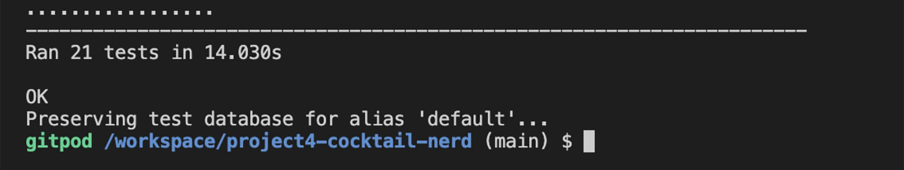
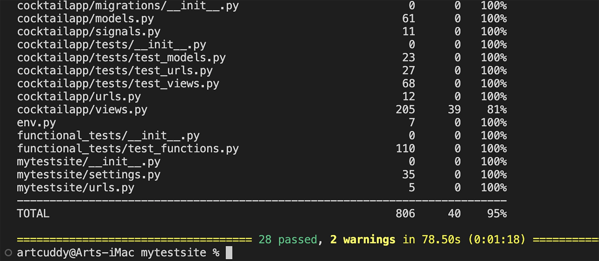
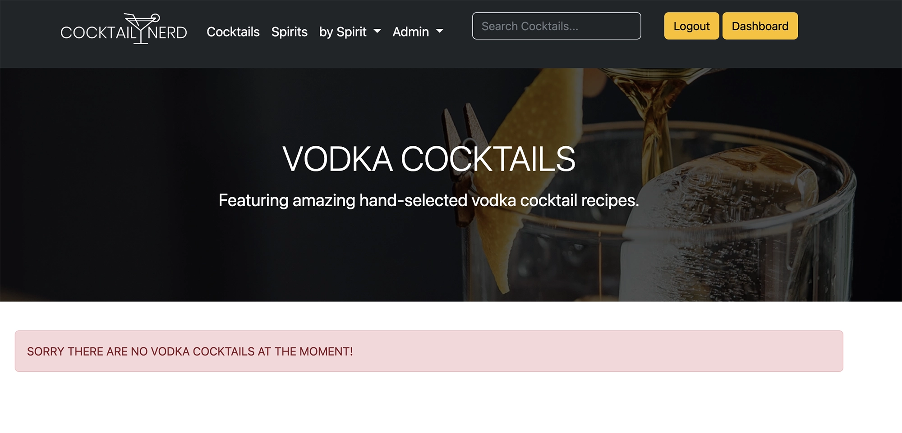
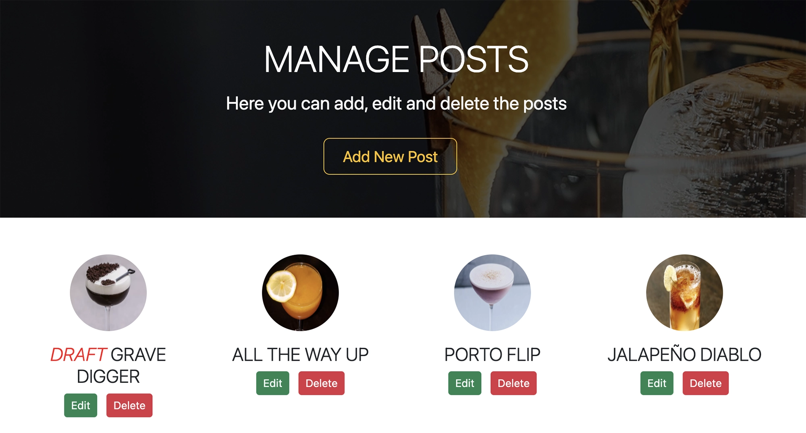
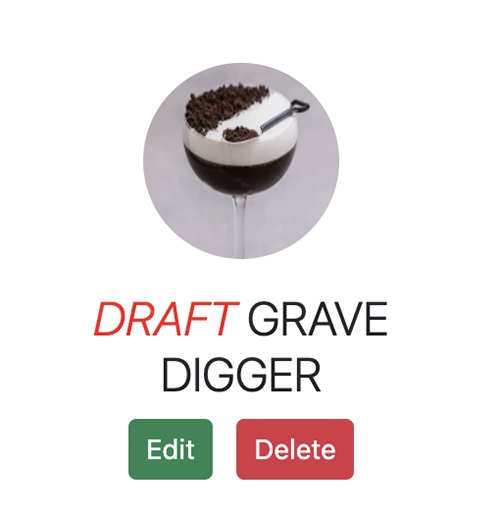

<h1 id="top">Cocktail Nerd Testing</h1>

Back to the [README](README.md)

<h1 id="contents">Contents</h1>

- [Automated Unit Testing Results](#automated-testing-results)
- [Automated Functional Testing Results](#automated-testing-results)
- [Manual Testing Results](#manual-testing-results)
- [Frontend](#frontend)
- [Backend/Admin Panel](#backend)
- [Python Validation - PEP8](#python-validation)
- [Lighthouse](#lighthouse)
- [Console Results](#console-results)
- [Bugs / Issues](#bugs)

Testing has taken place continuously throughout the development of the project. The app was tested regularly and deployed early to Heroku to confirm local and remote functioned the same. 


<h2 id="automated-testing-results">Automated Unit Testing Results</h2>


### Before Automated Unit testing coverage was at 79%


### After Automated Unit testing coverage is at 93%

* Increased the models coverage testing from 83% to 100%

* Increased the signals coverage testing from 73% to 100%

* Increased the views coverage testing from 55% to 80%


This could be improved on of course to get to 100% coverage and is something I could look at completing over time. All test files are located in the Cocktailapp/tests folder in the project.


28 tests completed successfully - PASS




<h2 id="automated-testing-results">Automated Functional Testing Results</h2>

<a href="#top">Back to the top</a>


The automated Automated Functional Tests were performed with Selenium & Pytest but this had to be run on a local development enviroment as the Chromedriver would not run on Gitpod, I have included the test file below.

The Username & Passwords were loaded from the seperate env.py file so as not to expose the username & password in the test file on Github.
This will need to be added should you want to test this in a local development enviroment.

I ran 7 automated functional tests:

## Automated Test Case

| USER STORY                     | TEST CASE                                                                                                 | PASS/FAIL |
|--------------------------------|-----------------------------------------------------------------------------------------------------------|-----------|
| User story 001 (Regular User): | As a regular user, I want to view the site navigate to a cocktail and like, rate and comment on the post. |           |
|                                | Test Case 001-1: Test home page renders for a logged out user                                             | PASS      |
|                                | Test Case 001-2: Test a logged in regular user can like a post                                            | PASS      |
|                                | Test Case 001-3: Test a logged in regular user can create a new comment                                   | PASS      |
|                                | Test Case 001-4: Test a logged in regular user can rate a post                                            | PASS      |
|                                |                                                                                                           |           |
| User story 002 (Super User):   | As a super user, I want to create a new cocktail post, delete a post & create a new category              |           |
|                                | Test Case 002-1: Test a logged in admin user can create a new post                                        | PASS      |
|                                | Test Case 002-2: Test a logged in admin user can create a new category                                    | PASS      |
|                                | Test Case 002-3: Test a logged in admin user can delete a post                                            | PASS      |

Automated Functional Testing Variables '.env' File

```python
os.environ["USER_NAME"] =  "<your_username_here>"
os.environ["USER_PASSWORD"] =  "<your_password_here>"

os.environ["REG_USER_NAME"] = "<your_username_here>"
os.environ["REG_USER_PASSWORD"] = "<your_password_here>"

```
Automated Functional Testing PyTest Code

```python

from django.test import LiveServerTestCase
from selenium import webdriver
from selenium.webdriver.common.by import By
import time
import os

USER_NAME = os.environ['USER_NAME']
USER_PASSWORD = os.environ['USER_PASSWORD']
REG_USER_NAME = os.environ['REG_USER_NAME']
REG_USER_PASSWORD = os.environ['REG_USER_PASSWORD']


class Hosttest(LiveServerTestCase):

    # Setup test enviroment
    def setUp(self):
        self.site_root_url = "https://project4-cocktail-nerd.herokuapp.com"
        self.driver = webdriver.Chrome()

    def visit(self, path):
        self.driver.get(self.site_root_url + path)

    def tearDown(self):
        self.driver.close()

    def site_admin_login(self):
        self.visit('/account/login/')

        time.sleep(2)

        self.driver.find_element(By.ID, 'id_login').send_keys(USER_NAME)
        self.driver.find_element(By.ID, 'id_password').send_keys(USER_PASSWORD)

        self.driver.find_element(By.ID, 'nerd-login').click()

    def site_reguser_login(self):
        self.visit('/account/login/')

        time.sleep(2)

        self.driver.find_element(By.ID, 'id_login').send_keys(REG_USER_NAME)
        self.driver.find_element(By.ID, 'id_password').send_keys(REG_USER_PASSWORD)

        self.driver.find_element(By.ID, 'nerd-login').click()

    # Test Case 001-1 home page renders for a logged out user
    def test_001_1_logged_out_homepage(self):
        self.visit('/')
        time.sleep(2)
        expected = "Cocktail Nerd"
        assert self.driver.title == expected

    
    # Test Case 002-1 a logged in admin user can create a new post
    def test_002_1_user_create_post(self):
        self.site_admin_login()

        self.visit('/add_post/')
        self.driver.set_window_size(1578, 1297)

        time.sleep(2)

        self.driver.find_element(By.ID, 'id_title').send_keys('Test Post 1')
        self.driver.find_element(By.XPATH, "//select[@name='status']/option[text()='Published']").click()

        time.sleep(2)

        summernote_frame = self.driver.find_element(By.ID, 'id_content_iframe')
        self.driver.switch_to.frame(summernote_frame)

        time.sleep(2)

        self.driver.find_element(By.XPATH, "//body/div[2]//div[@role='textbox']/p").send_keys("Test Post 5 Content")

        time.sleep(2)

        self.driver.switch_to.default_content()
        
        elem = self.driver.find_element(By.ID, 'nerd-add-post-button')
        elem_pos = elem.location["y"]
        self.driver.execute_script("window.scroll(0, {})".format(elem_pos))
        time.sleep(1)
        elem.click()

        expected = "https://project4-cocktail-nerd.herokuapp.com/add_post/?submitted=True"
        assert self.driver.current_url == expected


    # Test Case 002-2 a logged in admin user can create a new category
    def test_002_2_user_create_category(self):
        self.site_admin_login()
        self.visit('/add_category/')

        time.sleep(2)

        self.driver.find_element(By.ID, 'id_title').send_keys('New Cat')

        time.sleep(2)

        c = self.driver.find_element(By.ID, 'nerd-add-category-button')

        time.sleep(2)

        c.click()

        time.sleep(2)

        expected = "Cocktail Nerd | Manage Categories"
        assert self.driver.title == expected

    # Test Case 001-2 logged in regular user can like a post
    def test_001_2_user_liked_post(self):
        self.site_reguser_login()
        self.visit('/grave-digger/')
        self.driver.set_window_size(1578, 1297)

        time.sleep(2)

        self.driver.find_element(By.ID, 'like-button').click()
        
        like_count = self.driver.find_element(By.XPATH, "/html/body/div[@class='container mt-4 px-4']/div[@class='row']//article//span[@class='text-muted']").text

        assert like_count != 0


    # Test Case 001-3 a logged in regular user can create a new comment
    def test_001_3_user_can_comment(self):
        self.site_reguser_login()

        self.visit('/grave-digger/')
        self.driver.set_window_size(1578, 1297)

        time.sleep(2)

        self.driver.find_element(By.CLASS_NAME, 'textarea').send_keys('User can Comment Automated Test')

        elem = self.driver.find_element(By.CLASS_NAME, 'nerd-comment-submit')
        elem_pos = elem.location["y"]
        self.driver.execute_script("window.scroll(0, {})".format(elem_pos))

        time.sleep(1)

        elem.click()

        expected = self.driver.find_element(By.CLASS_NAME, 'alert-success').text

        assert expected == 'Nice one Reguser your comment is awaiting approval...'


    # Test Case 001-4 a logged in regular user can rate a post
    def test_001_4_user_can_rate_post(self):
        self.site_reguser_login()

        self.visit('/grave-digger/')
        self.driver.set_window_size(1578, 1297)

        time.sleep(2)
        
        p = self.driver.find_element(By.CLASS_NAME, 'star-ratings-rating-full')

        time.sleep(2)

        self.driver.execute_script("arguments[0].click();", p)

        score = self.driver.find_element(By.XPATH, "/html//div[@class='container mt-4 px-4']/div[@class='row']//article//div[@class='star-ratings']//ul[@class='star-ratings-rating-foreground']/li[3]/form[@action='/ratings/13/85/']/input[@name='score']")

        assert score != 0


    # Test Case 002-3 a logged in admin user can delete a post
    def test_002_3_user_delete_post(self):
        self.site_admin_login()
        self.visit('/test-post-1/')
        self.driver.set_window_size(1578, 1297)

        time.sleep(2)

        m = self.driver.find_element(By.ID, 'nerd-delete-post')

        time.sleep(2)

        m.click()
        
        d= self.driver.find_element(By.CLASS_NAME, "btn-outline-danger")
        d.click()
        
        expected = "Cocktail Nerd | Manage Posts"
        assert self.driver.title == expected


```

Automated Functional Testing Results - PASS

After Automated Functional Testing coverage is at 95%





<h2 id="manual-testing-results">Manual Functional Testing Results</h2>

<a href="#top">Back to the top</a>


The online version of the Manual Functional Test Case can be found here <a href="https://docs.google.com/spreadsheets/d/1pHhJgjFstH7W10ThXaSShCkr6ejq12iErlGVMZsmJKk/edit?usp=sharing" target="_blank">**HERE**</a><br>


<h2 id="frontend">Frontend</h2>

<a href="#top">Back to the top</a>


* The Signup, Login and Logout system is working as it should. It shows the right interactive message to the users on Signup, Login and Logout.


## Sign-up


## Login


## Logout


* The Profile Page is working properly. It updates the user information and uploads/updates the 
  user profile image. It shows the interactive message to the user once the update is complete.


* The user profile image in the comments section of the Post Details page has no issues and shows the user image 
  when it is uploaded by the user on the Profile Page. Otherwise the default avatar will be shown.


* All the internal links are working and bring the user to the right page on the website.
* All the external links are working and bring the user to the right social media page by 
  opening a new browser tab.


* The All Cocktails Page shows all the cocktail recipes. The pagination system is working, it adds another page when more than 6 cocktails on the page.


* The drop-down menu in the navbar shows a list of spirit categories on every page of the website.


* If a category is created and has no cocktails in it if you click on this category link an error will be shown that no posts from that category could be found.





* On the Post Details Page, the Like/unlike functionality is working without issues and shows 
  the right interactive message to the user when the heart icon is clicked.


* The comment form has no issues and it submits a new comment once the form is completed by a registered user. The comment is submitted for approval and the interactive message for this action is working. 


* The functionality to delete a comment, previously sent by the user is 
  working without issues. The Bootstrap model will open asking the user if they want to delete 
  the comment. Once the action is complete, the interactive message is displayed at the top of the page.


* The functionality to update comments, previously sent by the user is 
  working without issues. A new page is opened, to update the comment then when the update button is clicked. Once the action is complete, the interactive message is displayed at the top of the page.


* On the Posts MGT Page, the CRUD functionality is working without issues. Logged in staffusers or superuser can create, edit or delete posts. The interactive message is displayed at the top of the page.


* On the Posts MGT Page logged in staffusers or superuser can view draft posts and edit these before final publication. The post title will have "DRAFT" as the prefix to inducated this is a draft post and has not been published.





* On the Category MGT Page, the CRUD functionality is working without issues. Logged in staffusers or superuser can create, edit or delete categories. The interactive message is displayed at the top of the page.


* Staffusers or Superuser can add a new post on the frontend from the drop down Admin menu or by clicking the Add New Post button the Post Mgt page.


* Staffusers or Superuser can add a new category on the frontend from the drop down Admin menu or by clicking the Add New Category button the Category Mgt page.


<h2 id="backend">Backend/Admin Panel</h2>


<a href="#top">Back to the top</a>

* I have tested the Admin Panel repeatedly since the start of the project. All the models are working without issues.  
* Posts can be filtered by status, date, category or if featured or not
* Whenever a user comments on a cocktail the Superuser has to approve it before it will be displayed on the website. This functionality is 
  working without issues.
* When the staffuser/superuser is publishing a new cocktail recipe all the required fields have to be filled otherwise the author can't submit the post to the database.


<h2 id="python-validation">Python Validation - PEP8</h2>

<a href="#top">Back to the top</a>

* Python testing was done using the PEP8 Online to ensure there were no syntax errors in the project. All python files
were entered into the online checker and no errors were found in any of the Cocktail Nerd custom code.


# Cocktail Nerd - cocktailapp
* admin.py

* apps.py

* models.py

* forms.py

* signals.py

* urls.py

* views.py

* processors.py


# Cocktail Nerd - cocktailnerd
* admin.py
* There are 5 lines to long in the settings.py file but these are AUTH_PASSWORD_VALIDATORS and cannot be shortend
* The error about the env imported but not used is because it's in the development mode but will not be present on the production version


<h2 id="lighthouse">Lighthouse</h2>

<a href="#top">Back to the top</a>


Lighthouse was used to test Performance, Best Practices, Accessibility and SEO on Desktop and Mobile.


### Desktop Results:


### Mobile Results:


# HTML Validation


### CSS Validation


* Custom CSS was validated using W3C Jigsaw validation service. One warning was displayed, however, 
  this is related to Bootstrap 5 which will not affect the CSS performance.

<h2 id="console-results">Console Results</h2>

<a href="#top">Back to the top</a>


### Desktop

* The browser console is clean, no errors are  showing.

### Mobile

* The browser console is clean, no errors are  showing.


<h2 id="bugs">Bugs / Issues</h2>

<a href="#top">Back to the top</a>

## 1. Postgres database and testing

Due to the nature of the Postgres database being offered by Heroku and the way tests are run in Django, I encounterd an error while trying to run tests on my Django application with Heroku Postgres Add-on connected to the application.

<a href="https://github.com/artcuddy/project4-cocktail-nerd/issues/29">Github Issue #29</a>


Attempting to run the testing command "python3 manage.py test" results in error -> Got an error creating the test database: permission denied to create database


* To get this to work I created an additional Postgres database as an add-on and used this as my testing database.


* Also added an if 'test' in sys.argv: to the database settings in my project to connect to the test database when testing and an else statement to connect to the production databse when not testing. The below code is not the real production enviroment and has been changed for security reasons and is only to show what I did to solve the issue.

```python
# Updates Database Configuration
if 'test' in sys.argv:
    # Configuration for test database
    DATABASES = {
        'default': {
            'ENGINE': 'django.db.backends.postgresql',
            'NAME': 'd7osdssadag0ugv5',
            'USER': 'lhwwasadqlgjra',
            'PASSWORD': '1524f48a2ce41177c4ssdadasd3a11680b735302d14979d312ff36',
            'HOST': 'ec2-54-75-2326-118.eu-west-1.compute.amazonaws.com',
            'PORT': 5432,
            'TEST': {
                'NAME': 'd7osdssadag0ugv5', #This is an important entry
            }
        }
    }
else:
    DATABASES = {
        'default': dj_database_url.parse(os.environ.get('DATABASE_URL'))
    }
```

## 2. Confirmation Message

A confirmation message should be displayed when an authenticated user likes or unlikes a post this was not happening but revisted the code for the post like view and
refactored it to include a succes message when the user likes or unlikes the post.

<a href="https://github.com/artcuddy/project4-cocktail-nerd/issues/22">Github Issue #22</a>


```python

# Post like view
class PostLike(LoginRequiredMixin, View):
    """
    Post like view enables the post to be liked
    by the user and dispalys a confirmation message
    on like or unlike
    """
    def post(self, request, slug, *args, **kwargs):
        post = get_object_or_404(Post, slug=slug)
        if post.likes.filter(id=request.user.id).exists():
            post.likes.remove(request.user)
            messages.success(
                request,
                'What a shame you unliked this cocktail!'
                )
        else:
            post.likes.add(request.user)
            messages.success(
                request,
                'Thanks you liked this cocktail!'
                )
        return HttpResponseRedirect(reverse('post_detail', args=[slug]))

```

## 3. Draft Posts

During testing found a bug that draft posts could not be edited by an admin or staffuser on the frontend, fixed this by adding the below statement to the manage_posts.html file.

<a href="https://github.com/artcuddy/project4-cocktail-nerd/issues/28">Github Issue #28</a>

```python

  <h4 class="nerd-mgt-cat-title">
    <span class="nerd-draft-tag">DRAFT</span> {{ post.title }}
  </h4>

  <h4 class="nerd-mgt-cat-title">{{ post.title }}</h4>
  

```
This now adds a prefix of DRAFT if the post has a status of 0




## 4. Selenium Testing

Could not get Selenium to click the add new post button on the automated tests, kept getting error Element Is Not Clickable at Point

Found this resource on how to fix it https://www.testim.io/blog/selenium-element-is-not-clickable-at-point/

Added this code below to fix as I needed to scroll to the button position before .click()

<a href="https://github.com/artcuddy/project4-cocktail-nerd/issues/30">Github Issue #30</a>

```python
elem = self.driver.find_element(By.ID, 'nerd-add-post-button')
        elem_pos = elem.location["y"]
        self.driver.execute_script("window.scroll(0, {})".format(elem_pos))
        time.sleep(1)
        elem.click()
```


All bugs found during the development process have been fixed and as such I have not encountered any new ones since submission.... fingers crossed!