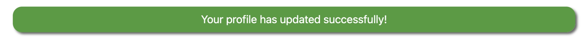
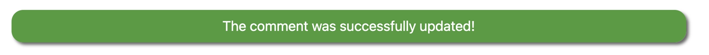

<h1 id="top">Cocktail Nerd Testing</h1>

Back to the [README](README.md)

<h1 id="contents">Contents</h1>

- [Automated Unit Testing Results](#automated-testing-results)
- [Automated Functional Testing Results](#automated-testing-results)
- [Manual Testing Results](#manual-testing-results)
- [Frontend](#frontend)
- [Backend/Admin Panel](#backend)
- [Python Validation - PEP8](#python-validation)
- [Lighthouse](#lighthouse)
- [Console Results](#console-results)
- [Bugs](#bugs)

Testing has taken place continuously throughout the development of the project. The app was tested regularly and deployed early to Heroku to confirm local and remote functioned the same. 


<h2 id="automated-testing-results">Automated Unit Testing Results</h2>


### Before Automated Unit testing coverage was at 79%


### After Automated Unit testing coverage is at 93%

* Increased the models coverage testing from 83% to 100%

* Increased the signals coverage testing from 73% to 100%

* Increased the views coverage testing from 55% to 80%

After automated testing had been setup I was able to get the total automated test coverage up to 93%.


This could be improved on of course to get to 100% coverage and is something I could look at completing over time.


<h2 id="automated-testing-results">Automated Functional Testing Results</h2>

<a href="#top">Back to the top</a>


The automated functional tests are performed with Selenium IDE & Pytest


<h2 id="manual-testing-results">Manual Testing Results</h2>

<a href="#top">Back to the top</a>


The online version of the Manual Functionality Test Case can be found here <a href="https://docs.google.com/spreadsheets/d/1pHhJgjFstH7W10ThXaSShCkr6ejq12iErlGVMZsmJKk/edit?usp=sharing" target="_blank">**HERE**</a><br>


<h2 id="frontend">Frontend</h2>

<a href="#top">Back to the top</a>


* The Signup, Login and Logout system is working as it should. It shows the right interactive message to the users on Signup, Login and Logout.


## Sign-up


## Login


## Logout


* The Profile Page is working properly. It updates the user information and uploads/updates the 
  user profile image. It shows the interactive message to the user once the update is complete.





* The user profile image in the comments section of the Post Details page has no issues and shows the user image 
  when it is uploaded by the user on the Profile Page. Otherwise the default avatar will be shown.


* All the internal links are working and bring the user to the right page on the website.
* All the external links are working and bring the user to the right social media page by 
  opening a new browser tab.


* The All Cocktails Page shows all the cocktail recipes. The pagination system is working, it adds another page when more than 6 cocktails on the page.


* The drop-down menu in the navbar shows a list of spirit categories on every page of the website.


* If a category is created and has no cocktails in it if you click on this category link an error will be shown that no posts from that category could be found.


* On the Post Details Page, the Like/unlike functionality is working without issues and shows 
  the right interactive message to the user when the heart icon is clicked.


* The comment form has no issues and it submits a new comment once the form is completed by a registered user. The comment is submitted for approval and the interactive message for this action is working. 


* The functionality to delete a comment, previously sent by the user is 
  working without issues. The Bootstrap model will open asking the user if they want to delete 
  the comment. Once the action is complete, the interactive message is displayed at the top of the page.


* The functionality to update comments, previously sent by the user is 
  working without issues. A new page is opened, to update the comment then when the update button is clicked. Once the action is complete, the interactive message is displayed at the top of the page.





* On the Posts MGT Page, the CRUD functionality is working without issues. Logged in staffusers or superuser can create, edit or delete posts. The interactive message is displayed at the top of the page.


* On the Category MGT Page, the CRUD functionality is working without issues. Logged in staffusers or superuser can create, edit or delete categories. The interactive message is displayed at the top of the page.


* Staffusers or Superuser can add a new post on the frontend from the drop down Admin menu or by clicking the Add New Post button the Post Mgt page.


* Staffusers or Superuser can add a new category on the frontend from the drop down Admin menu or by clicking the Add New Category button the Category Mgt page.


<h2 id="backend">Backend/Admin Panel</h2>


<a href="#top">Back to the top</a>

* I have tested the Admin Panel repeatedly since the start of the project. All the models are working without issues.  
* Posts can be filtered by status, date, category or if featured or not
* Whenever a user comments on a cocktail the Superuser has to approve it before it will be displayed on the website. This functionality is 
  working without issues.
* When the staffuser/superuser is publishing a new cocktail recipe all the required fields have to be filled otherwise the author can't submit the post to the database.


<h2 id="python-validation">Python Validation - PEP8</h2>

<a href="#top">Back to the top</a>

* Python testing was done using the PEP8 Online to ensure there were no syntax errors in the project. All python files
were entered into the online checker and no errors were found in any of the Cocktail Nerd custom code.


# Cocktail Nerd - cocktailapp
* admin.py

* apps.py

* models.py

* forms.py

* signals.py

* urls.py

* views.py

* processors.py


# Cocktail Nerd - cocktailnerd
* admin.py
* There are 5 lines to long in the settings.py file but these are AUTH_PASSWORD_VALIDATORS and cannot be shortend
* The error about the env imported but not used is because it's in the development mode but will not be present on the production version


<h2 id="lighthouse">Lighthouse</h2>

<a href="#top">Back to the top</a>


Lighthouse was used to test Performance, Best Practices, Accessibility and SEO on Desktop and Mobile.


### Desktop Results:


### Mobile Results:


# HTML Validation


### CSS Validation


* Custom CSS was validated using W3C Jigsaw validation service. One warning was displayed, however, 
  this is related to Bootstrap 5 which will not affect the CSS performance.

<h2 id="console-results">Console Results</h2>

<a href="#top">Back to the top</a>


### Desktop

* The browser console is clean, no errors are  showing.

### Mobile

* The browser console is clean, no errors are  showing.


<h2 id="bugs">Bugs</h2>

<a href="#top">Back to the top</a>

Due to the nature of the Postgres database being offered by Heroku and the way tests are run in Django, I encounterd an error while trying to run tests on my Django application with Heroku Postgres Add-on connected to the application.


Attempting to run the testing command results in this error


* Got an error creating the test database: permission denied to create database


* To get this to work I created an additional Postgres database as an add-on and used this as my testing database.


* Also added an if 'test' in sys.argv: to the database settings in my project to connect to the test database when testing and an else statement to connect to the production databse when not testing. The below code is not the real production enviroment and has been changed for security reasons and is only to show what I did to solve the issue.

```
# Updates Database Configuration
if 'test' in sys.argv:
    # Configuration for test database
    DATABASES = {
        'default': {
            'ENGINE': 'django.db.backends.postgresql',
            'NAME': 'd7osdssadag0ugv5',
            'USER': 'lhwwasadqlgjra',
            'PASSWORD': '1524f48a2ce41177c4ssdadasd3a11680b735302d14979d312ff36',
            'HOST': 'ec2-54-75-2326-118.eu-west-1.compute.amazonaws.com',
            'PORT': 5432,
            'TEST': {
                'NAME': 'd7osdssadag0ugv5', #This is an important entry
            }
        }
    }
else:
    DATABASES = {
        'default': dj_database_url.parse(os.environ.get('DATABASE_URL'))
    }
```

All bugs found during the development process have been fixed and as such I have not encountered any new ones since submission.... fingers crossed!